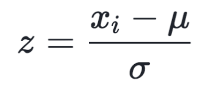

# Self-Driving Car Engineer Nanodegree

## Project: **Build a Traffic Sign Recognition Program** 
  

**Desciption:** This projects aims to create classifier to detect traffic signs.  

---
The goals / steps of this project are the following:
* Load the data set
* Explore, summarize and visualize the data set
* Design, train and test a model architecture
* Use the model to make predictions on new images
* Analyze the softmax probabilities of the new images
* Summarize the results with a written report

---
### Dependencies
This project requires Python 3.5 and the following Python libraries must be imported:

- OpenCV
- NumPy
- scikit-learn
- TensorFlow
- Matplotlib
- csv
- PIL
- pickle
- math
   
---
## The Pipeline  

### Step1: Loading The Raw Data   
The raw data have been provided in pickled format.  
Thus, raw data was imported via pickle.  

### Step2: Dataset Exploration  
- The image shape = (32, 32, 3) 
- Number of classes (labels) = 43
- Number of training images = 34799
- Number of testing images = 12630

  

Also, image class distrubitons were plotted as follows:  

  

The variation in the classes for the datasets (trainig, validation and test) seem similar to each other.  

### Step3: Pre-Processing the Image
This step is composed of **3 sub-steps** as follows:  
- Creating the Pipeline for Initial Processing (For Better Features)  
- Creating the Pipeline for Augmentation (For Increasing Amount of the Data)  
- Normalization and Grayscale Conversion

**For the initial procesing:**  
* Histogram equalization is applied to improce the contrast of the image  
* The contrast and the sharpness are changed to make the features more obvious  

**For the augmentation:**  
* Image is translated and rotated  
* Shearing is applied  

And finally, the image is converted into grayscale and normalized by using the following formula:  
  

Example pre-processing results are shown below:  
  

**Finding:** I tried several parameters in the pre-processing step and this took a lot of time!  
My very general finding is that adding noise to the images can mislead the training.  
Thus, I kept the transformations in a minor level.

After all images are processed, the datasets are shuffled in order to elimate the influence of the order of the data!  

### Step4: The Model
The LeNet architecture is used and it's schema is shown below:  
  

I modified the convolutional layers because original architecture of the LeNet5 can not exceed 86% in the validation accuracy.  
Thus, I modified last 2 fully connected layers.  
In the layer-4, I set the input as 200 and set the output as 129 which is 3 times of the classes.  
Naturally, in the layer-5, I set the input as 129 and the output as 43 which is the number of clasess.  
By doing so, I exceed the 93% (mimimum validation accuracy for this project) after the 7th epoch.

The learning rate is set 0.0008  
The optimizer is AdamOptimizer (from tf.train.AdamOptimizer)  
The EPOCHS is set 70   
The BATCH SIZE is set 100  

#### Accuracy
* Training Accuracy: 0.989  
* Validation Accuracy: 0.967  
* Testing Accuracy: 0.952  

For the given parameters and the architecture above, the validation accuracy converged around 96% as shown below:  
  

I found 5 images from the web, and the testing accuracy is 100% for those images (shown below):  
  

Later, the top 3 predictions were calculated for the images as shown below:  
  

Finally, the softmax probabilities were calculated for the images as shown below:  
  

### Conclusion
With a heuristic approach, I tried many parameters in order to increase the validation accuracy.  
Also I tweek around the pre-processing parameters so that distinctive elements in the images appeared.  
More importantly, modifying the LeNet5 architecture as described above increased the validation accuracy drastically.  

